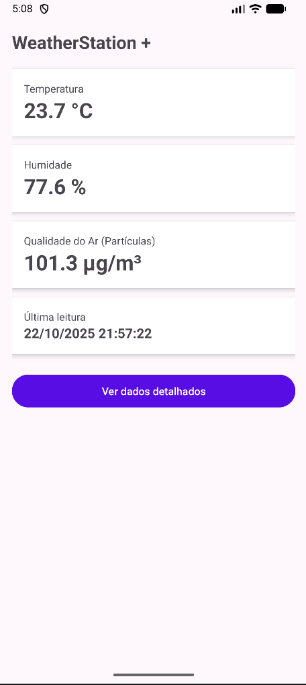
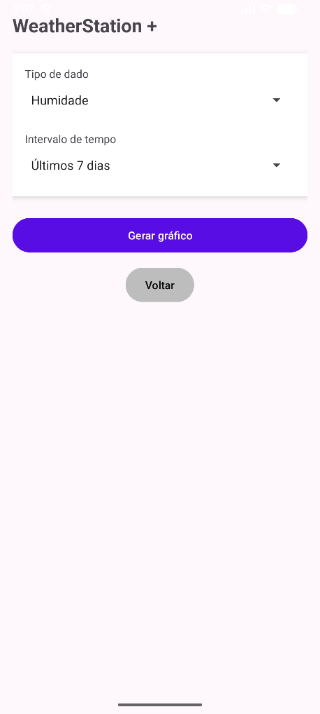
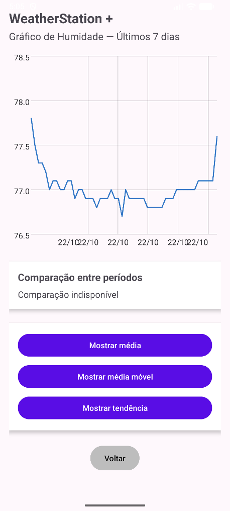

# WeatherStation+ 

WeatherStation+ is an Android application developed to display and analyse data collected from a weather station.

The application provides the latest readings for temperature, humidity and air quality, while also allowing users to explore historical data through charts.

## Features

- Display of the latest temperature reading
- Display of humidity levels
- Air quality monitoring through particle measurements
- Date and time of the latest reading
- Selection of different types of meteorological data
- Selection of time intervals
- Historical data visualisation through charts
- Average calculation
- Moving average visualisation
- Trend visualisation

## Technologies

- Kotlin
- Android Studio
- Firebase Firestore
- Android SDK

## Screenshots

### Main Screen

Displays the latest temperature, humidity and air quality readings.

### Data Selection

Allows the user to select the type of data and the time interval to analyse.

### Charts

Displays historical meteorological data through interactive charts.

## Project Context

This application was developed as an academic project during my Computer Engineering degree.

The main goal was to create an Android application capable of retrieving meteorological data and presenting it in a simple and understandable way, including graphical analysis of historical values.

## Author

**Mariana Monteiro**

- [GitHub](https://github.com/MarianaMonteiro79)
- [LinkedIn](https://www.linkedin.com/in/marianafmmonteiro/)
